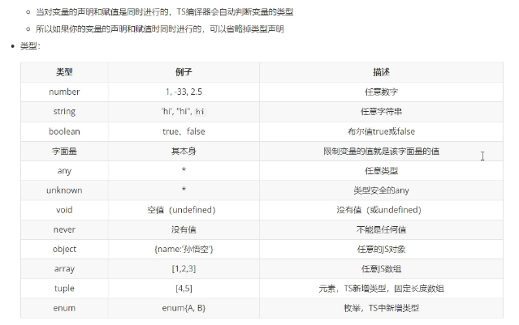

# 搭建TypeScript开发环境
## 安装typescript
```
npm install -g typescript
```

## 编译ts文件生成js
tsc 文件名.ts

## vscode中自动编译
tsc --init 生成tsconfig.json文件<br>
"outDir": "./" 打开注释，配置编译生成的js文件路径<br>
"outDir": "./js"<br>
任务  ->  运行任务  ->  typescript  ->  tsc:监视 tsconfig.json<br>
或<br>
tsc -w 监控全部   tsc index.ts -w监控某个文件

# TS类型


### unknown是类型安全的any

```
let s: string;
let d: any;
d = 'world';
let e: unknown;
e = 'hello';
s = d // d是any类型，不会报错
s = e // e是unknown类型，会报错  Type 'unknown' is not assignable to type 'string'.
```

### 类型断言

```
/*
* 语法
* 	变量 as 类型
* 	<类型>变量
*/
s = e as string; // 加了类型断言，这样子e是unknown类型也不会报错了
s = <string>e;
```

### 元组

```
/**
 * 元组，元组就是固定长度的数组
 *  语法：[类型，类型，类型]
 */
let h: [string, number]
h = ['12'] // 报错
h = ['aa', 10]
/**
let h: [string, number]
元组，元组就是固定长度的数组 语法：[类型，类型，类型]
Type '[string]' is not assignable to type '[string, number]'.
  Source has 1 element(s) but target requires 2.
*/
```

### 枚举

```
/**
 * 枚举 enum
 */
 //enum Gender {
 //  Male,
 //  Female
 //}
 enum Gender {
   Male = 1,
   Female = 2
 }
 let i: { name: string, gender: Gender }
 i = { name: '孙悟空', gender: Gender.Male }
```

### | 表示或， & 表示与

```
 /**
  *  | 表示或
  *  & 表示与
  */
 let j: string | number
 j = 10
 j = 'a'
 let k: {name: string} & {age: number}
 k = {name: 'zs', age: 20}
```

### 类型的别名

```
 // 类型的别名
type myString = string
let m: myString // 类似于 m: string
m = 'zs'
type mType = 1 | 2 | 3 | 4 | 5
let n: mType
let o: mType
n = 1
o = 20 // 报错，mType类型限制只能取1-5中的一个
```

# ts编译选项

```
tsc -init  生成tsconfig.json

tsc 编译项目下所有的ts文件

tsc index.ts -w  监听index.ts文件修改了就编辑生成index.js

tsc -w 监听项目下所有的ts文件  有修改就生成对应的js文件

tsconfig.json是ts编辑器的配置文件，ts编译器可以根据他的信息来对代码进行编译
include  用来指定哪些ts文件需要被编译
路径：** 表示任意目录
           * 表示任意文件
exclude 不需要被编辑的文件目录
默认值：[“node_modules”, "bower_components", "jspm_packages"]
extends 定义被继承的配置文件
files 指定被编译文件的列表，只有需要编译的文件少时才会用到
{
    "include": [
    	"./src/**/*"
    ],
    "exclude": [
    	"./src/hello/**/*"
    ],
    "extends": "./configs/base", // 当前配置文件中会自动包含config目录下base.json中所有的配置信息
    "files": ["core.ts", "sys.ts", "types.ts", "tsc.ts"], // 列表中的文件都会被ts编译器所编译
    // 编辑选项是配置文件中非常重要也比较复杂的配置选项
    // 在compilerOptions中包含多个字选项，用来完成对编译的配置
    "compilerOptions": {
    	// 设置ts代码编译的目标版本
    	// 可选值：ES3(默认)、ES5、ES6/ES2015、ES7/ES2016、ES2017、ES2018、ES2019、ES2020、ESNext
    	"target": "ES6",
    	// module 指定要使用的模块化的规范
    	// 'none', 'commonjs', 'amd', 'system', 'umd', 'es6', 'es2015', 'es2020', 'esnext'
    	"module": "es2015",
    	// lib用来指定项目中要使用的库，一般情况下不需要改
    	// ES5、ES6/ES2015、ES7/ES2016、ES2017、ES2018、ES2019、ES2020、ESNext', 'DOM', 'WebWorker', 'ScriptHost'
    	"lib": ["ES6", "DOM"],
    	// 用来指定编译后文件所在的目录
    	"outDir": "./dist",
    	// 将编译后的代码合并为一个文件
    	// 设置outFile后，所有的全局作用域中的代码会合并到同一个文件中，模块化的文件不参与合并，并且上文中的module要是amd或system
    	"outFile": "./dist/app.js",
    	// 是否对js文件进行编译，默认是false
    	"allowJs": false,
    	// 是否检查js代码是否符合语法规范，默认是false
    	"checkJs": false,
    	// 是否移除注释，默认是false
    	"removeComments": false,
    	// 不生成编译后的文件，默认是false
    	"noEmit": false,
    	// 当有错误时不生成编译后的文件
    	"noEmitOnError": false,
    	// 所有严格检查的总开关,设置为true之后 相当于alwaysStrict noImplicitAny noImplicitThis strictNullChecks这些检查都为true了
    	"strict": true, 
    	// 用来设置编译后的文件是否使用严格模式，默认false
    	"alwaysStrict": false,
    	// 不允许隐式的any类型  function fn(a) { return a } 参数a没有写类型，类型推断为any，此时就是隐式的any类型
    	"noImplicitAny": false,
    	// 不允许不明确类型的this,默认false允许
    	"noImplicitThis": false,
    	// 严格检查空值
    	"strictNullChecks": false
    }
}
```
# webpack配置ts项目 

代码地址webpack-ts

1. 安装相关依赖

```
cnpm i -D webpack webpack-cli typescript ts-loader
```

2. 编写webpack.config.js文件

3. 编写tsconfig.json

4. 编写package.json

5. 引入webpack插件

```
cnpm i -D html-webpack-plugin clean-webpack-plugin
// 引入html插件
const HTMLWebpackPlugin = require('html-webpack-plugin')
// 引入clean插件
const { CleanWebpackPlugin } = require('clean-webpack-plugin')
// 配置webpack插件
plugins: [
  new CleanWebpackPlugin(),
  new HTMLWebpackPlugin({
    template: './src/index.html'
  })
],
```

```
cnpm i -D webpack-dev-server
package.json
"start": "webpack serve --open --mode development"
npm run start自动打开浏览器
```
6. 配置babel

```
cnpm i -D @babel/core @babel/preset-env babel-loader core-js
```

tsconfig

```
{
  "compilerOptions": {
    "module": "es2015",
    "target": "es2015",
    "strict": true
  }
}
```

package.json

```
"build": "webpack --mode production",
"start": "webpack serve --open --mode development"
```

index.ts

```
// ie中没有Promise这个对象，所以打包的时候corejs就会使用自己的promise使得ie也能使用Promise
/**
 * core-js是完全模块化的javascript标准库。 包含ECMA-262至今为止大部分特性的polyfill
 *  如promises、symbols、collections、iterators、typed arrays、etc，以及一些跨平台的WHATWG / W3C特性的polyfill，如WHATWG URL。 
 * 它可以直接全部注入到全局环境里面，帮助开发者模拟一个包含众多新特性的运行环境
 * 这样开发者仅需简单引入core-js，仍然使用最新特性的ES写法编码即可；也可以不直接注入到全局对象里面，这样对全局对象不会造成污染
 */
// 所以无这一句代码，打包出来的bundle.j和index.ts差不多，有这句，打包出来的bundle.js很长很长，多了很多内容
console.log(Promise);
```

webpack.config.js

```
const path = require('path')
// 引入html插件
const HTMLWebpackPlugin = require('html-webpack-plugin')
// 引入clean插件
const { CleanWebpackPlugin } = require('clean-webpack-plugin')
module.exports = {
  entry: "./src/index.ts",
  output: {
    // 指定打包文件的目录
    path: path.resolve(__dirname, 'dist'),
    // 打包后的文件
    filename: 'bundle.js',
    // // 告诉webpack不使用箭头函数，转换为Function
    // corejs处理promise等非自己写的函数转换的时候，会处理为箭头函数
    // 可以注释调这里的代码，看一看bundle.js的差异
    environment: {
      arrowFunction: false
    }
  },
  // 指定webpack打包时要使用的模块
  module: {
    // 指定要加载的规则
    rules: [
      {
        // test指定的是规则生效的文件
        test: /\.ts$/,
        // 要使用的loader
        use: [
          // 配置babel
          {
            // 指定加载器
            loader: 'babel-loader',
            // 设置babel
            options: {
              // 设置预定义的环境
              presets: [
                [
                  // 指定环境的插件
                  "@babel/preset-env",
                  // 配置信息
                  {
                    targets: {
                      "chrome": "60",
                      "ie": "11"
                    },
                    // 指定corejs的版本
                    "corejs": "3",
                    // 使用corejs的方式  "usage" 按需加载
                    "useBuiltIns": "usage"
                  }
                ]
              ]
            }
          },
          'ts-loader'// 从后往前执行
        ],
        // 要排除的文件
        exclude: /node-modules/
      }
    ]
  },
  // 配置webpack插件
  plugins: [
    new CleanWebpackPlugin(),
    new HTMLWebpackPlugin({
      template: './src/index.html'
    })
  ],
  // 用来设置引用模块 export import
  resolve: {
    extensions: ['.ts', '.js']
  }
}
```

# 抽象类

```
// 以abstract开头的类是抽象类
// 抽象类和其他类区别不大，只是不能用来创建对象
// 抽象类就是专门用来被继承的类
abstract class Animal {
    name: string
    constructor(name: string) {
        this.name = name    
    }
    // 抽象方法使用abstract开头，没有方法体
    // 抽象方法只能定义在抽象类中，子类必须对抽象方法进行重写
    abstract sayHello(): void;
}
```

# 接口

接口用来定义一个类结构，用来定义一个类中应该包含哪些属性和方法<br>
同时接口也可以当场类型声明去使用<br>
接口是定义一个标准<br>

```
interface myInterface{
    name: string;
    age: number;
}
interface myInterface{
    gender: number;
}
// 两个myInterface会合并
const obj: myInterface = {
    name: 'zw',
    age: 20,
    gender: '男'
}
```
接口可以在定义类的时候去限制类的结构<br>
接口中的所有的属性都不能有实际的值<br>
接口只定义对象的结构，而不考虑实际值<br>

```
interface myInter{
	name: string;
	sayHello():void;
}
```

定义类时，可以使类去实现一个接口，实现接口就是使类满足接口的要求

```
class MyClass implements myInter{
    name: string;
    constructor(name: string) {
    	this.name = name
    }
    
    sayHello() {
    	console.log('hh')
    }
    	
}
```

# TS存取器

```
class Person {
  /**
   * private 私有属性，只有当前类可以访问（修改）
   * public  公有属性，修饰的属性可以在任务位置进行访问（修改），默认值
   * protected 受保护属性  只能当前类及其子类访问（修改）
   */
  private _name: string;
  private _age: number;
  constructor(name: string, age: number) {
    this._name = name
    this._age = age
  }
  // 属性是在对象中设置的，属性可以任意的被修改
  // 属性可以任意被修改将会导致对象中的数据变得非常不安全
  // ts存取器  下面这种写法是提供的setter getter简便写法
  get name() {
    return this._name
  }
  set name(value) {
    this._name = value
  }
  get age() {
    return this._age
  }
  set age(value) {
    if(value >= 0) {
      this._age = value
    }
  }
}
let p = new Person('孙悟空', 18)
console.log(p.name); // 孙悟空
p.name = '猪八戒'
p.age = 22
console.log(p); // Person {_name: '猪八戒', _age: 22, name: '猪八戒', age: 22}
```

```
class C {
  name: string;
  age: number;
  constructor(name: string, age: number) {
    this.name = name
    this.age = age
  }
}
console.log(new C('zs', 18));
// 这种方式也是ts提供的语法糖，是对上述class C方式的简写
class C1{
  constructor(public name: string, public age: number) {}
}
console.log(new C1('zs', 18));
```
# 泛型

```
// 在定义函数或是类时，如果遇到类型不明确就可以使用泛型
function fn<T>(a: T): T { return a }

// 可以直接调用具有泛型的函数
console.log(fn(a: 10)) // 不指定泛型，TS可以自动对队形进行推断
console.log(fn<string>(a: 'hello'))  // 指定泛型
// 泛型可以同时指定多个
function fn2<T, K>(a: T, b: K): T{
    return a
}
console.log(fn2<string, number>('hello', 10))

// T extends Inter 表示泛型T必须是Inter实现类(子类)
interface Inter{
    length: number;
}
function fn3<T extends Inter>(a: T): number{
    return a.length
}
console.log(fn3('hello'));
console.log(fn3({length: 10}));

class MyClass<T> {
  constructor(public name: T) {}
}
console.log(new MyClass<string>('孙悟空'));
```